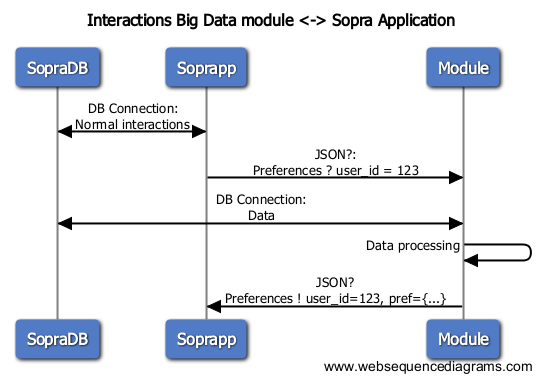
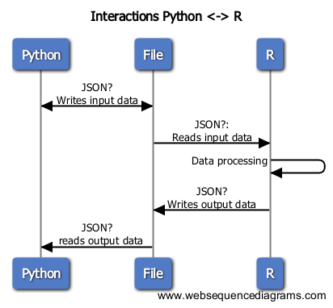

############
Architecture
############

===================
Global Architecture
===================

The following figures shows our global architecture :

This sums up the general interactions in our application.

* Any external application (represented by SopraHR on the figure) can communicate to our Django module through the API, by HTTP requests.
* Django communicates with our Database and our R Scripts
* Django serves the response

======
Models
======

We defined the 3 following models :

.. code-block:: python

    class Employee(models.Model):
        last_name = models.CharField(max_length=100)
        first_name = models.CharField(max_length=100)
        birth_date = models.DateField()
        joined_date = models.DateField()
        salary = models.FloatField()
        phone = models.CharField(max_length=50)
        performance_indice = models.IntegerField()
        gender = models.CharField(max_length=1)
        children_number = models.IntegerField()
        adress = models.TextField()
        mail = models.EmailField()
        married = models.BooleanField()

    class Widget(models.Model):
        name = models.CharField(max_length=100)
        author = models.CharField(max_length=100)
        description = models.TextField()

    class Notation(models.Model):
        employee = models.ForeignKey('Employee')
        widget = models.ForeignKey('Widget')
        rating = models.IntegerField()

For more information on Django models, feel free to read the `Django models documentation`_.

.. _Django models documentation: https://docs.djangoproject.com/en/1.9/topics/db/models/

=============
Requests Flow
=============

In this sections we will explain the flow of 2 typical requests on our API.

--------------------
Basic model requests
--------------------

Example : ``http://localhost:8000/api/notations/2/``

Every basic database serving requests are handled thanks to the ``serializers``, ``viewsets`` and ``routers`` of the `Django REST framework`_.

.. _Django REST framework: http://www.django-rest-framework.org/

Example of a serializer :

.. code-block:: python

    class NotationSerializer(serializers.HyperlinkedModelSerializer):

        class Meta:
            model = Notation
            fields = (
                'pk',
                'employee',
                'widget',
                'rating'
            )

Example of a viewset :

.. code-block:: python

    class NotationViewSet(viewsets.ModelViewSet):
        queryset = Notation.objects.all()
        serializer_class = NotationSerializer

Router :

.. code-block:: python

    router = routers.DefaultRouter()
    router.register(r'employees', EmployeeViewSet)
    router.register(r'widgets', WidgetViewSet)
    router.register(r'notations', NotationViewSet)

    urlpatterns = [
        url(r'', include(router.urls)),
        url(r'api-auth/', include(
            'rest_framework.urls',
            namespace='rest_framework'
        ))
    ]

-----------------------
Recommendation requests
-----------------------

Here is a figure representing the flow of a request from an external application to our module.

And the following figure represents the interactions between python and R :

1. The external application makes an HTTP request to get a recommendation for user with pk=123
2. Django gets all the necessary information on the user in the database and drops it into a json file
3. Django calls the R Script
4. The R script loads the json file to get the data on the user, processes the data, and drops the result into a json file
5. Once the R script finishes, Django reads the result json file, to get the result to serve as a response to the external application

**All the logic for this kind of requests can be found in the viewsets :** ``./API/viewsets.py``

=========
R Scripts
=========

The R scripts manipulate a library called ``RecommenderLab``. You should definitely check out `RecommenderLab's documentation`_ to understand the scripts. They are fairly well commented and should be easy to understand.

.. _RecommenderLab's documentation: https://cran.r-project.org/web/packages/recommenderlab/vignettes/recommenderlab.pdf

**Every R script can be found in our package** ``RLib``

